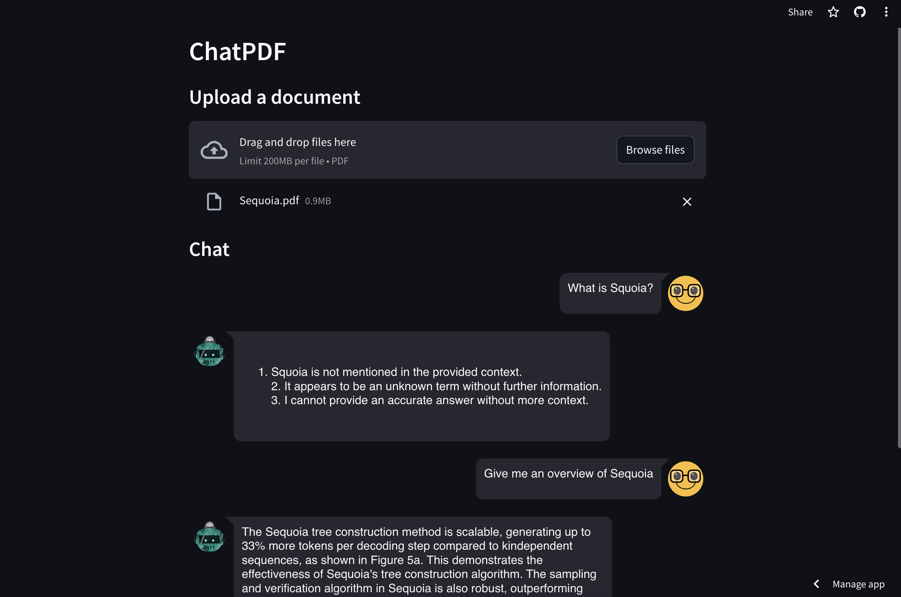

# mini_project9_streamlit_llm

Build a ChatPDF Retrieval Augmented Generation application with LLM model from HuggingFace and UI built with Streamlit.

demo: [Streamlit](https://ragapplication.streamlit.app/)
[HuggingFace](https://huggingface.co/spaces/OriDragon2000/simpleRAG)


> With the rise of Large Language Models and their impressive capabilities, many fancy applications are being built on top of giant LLM providers like OpenAI and Anthropic. The myth behind such applications is the RAG framework, which has been thoroughly explained in the references.

## Prerequisites
Dependencies:
- langchain
- streamlit
- streamlit-chat
- pypdf
- chromadb
- fastembed

```bash
pip install langchain streamlit streamlit_chat chromadb pypdf fastembed
```

How to Build Your Own RAG: Langchain + HuggingFace + Streamlit


We will build an application that is something similar to [ChatPDF](https://www.chatpdf.com/) but simpler. Where users can upload a PDF document and ask questions through a straightforward UI. Our tech stack is super easy with Langchain, HuggingFace, and Streamlit.


* LLM Server: The most critical component of this app is the LLM server. Thanks to [HuggingFace](https://huggingface.co/), we can easily access the latest models and deploy them on our local machine. For this project, we’ll be using the Mistral model from HuggingFace, which is a retrieval-augmented generation model. The Mistral model is a powerful model that can generate text based on the context provided to it. It’s a great choice for our application.

* RAG: Undoubtedly, the two leading libraries in the LLM domain are [Langchain](https://python.langchain.com/docs/get_started/introduction) and [LLamIndex](https://www.llamaindex.ai/). For this project, I’ll be using Langchain due to my familiarity with it from my professional experience. An essential component of any RAG framework is vector storage. We’ll be using [Chroma](https://github.com/chroma-core/chroma) here, as it integrates well with Langchain.


* Chat UI: The user interface is also an important component. Although there are many technologies available, I prefer using [Streamlit](https://streamlit.io), a Python library, for peace of mind.

## Setup HuggingFace Model
First things first, we need to set up the LLM server. Here’s how you can do it:
1. Create a token on HuggingFace.
2. Use the following code to use the newest Mistral model from HuggingFace which has much better performance than the v0.1 model. 
```python
      repo_id = "mistralai/Mistral-7B-Instruct-v0.2"
        self.model = HuggingFaceHub(huggingfacehub_api_token='hf_xxxxxxxxxx', 
                            repo_id=repo_id, model_kwargs={"temperature":0.8, "max_new_tokens":100})
```

## Build the RAG Pipeline
The second step in our process is to build the RAG pipeline.
1.  Given the simplicity of our application, we primarily need two methods: ```ingest``` and ```ask```.
    ```python
    def ingest(self, pdf_file_path: str):
            docs = PyPDFLoader(file_path=pdf_file_path).load()
            chunks = self.text_splitter.split_documents(docs)
            chunks = filter_complex_metadata(chunks)

            vector_store = Chroma.from_documents(documents=chunks, embedding=FastEmbedEmbeddings())
            self.retriever = vector_store.as_retriever(
                search_type="similarity_score_threshold",
                search_kwargs={
                    "k": 3,
                    "score_threshold": 0.5,
                },
            )

            self.chain = ({"context": self.retriever, "question": RunnablePassthrough()}
                        | self.prompt
                        | self.model
                        | StrOutputParser())

        def ask(self, query: str):
            if not self.chain:
                return "Please, add a PDF document first."

            return self.chain.invoke(query)
    ```

    The ```ingest``` method accepts a file path and loads it into vector storage in two steps: first, it splits the document into smaller chunks to accommodate the token limit of the LLM; second, it vectorizes these chunks using Qdrant FastEmbeddings and stores them into Chroma.


    The ```ask``` method handles user queries. Users can pose a question, and then the RetrievalQAChain retrieves the relevant contexts (document chunks) using vector similarity search techniques.


2. With the user's question and the retrieved contexts, we can compose a prompt and request a prediction from the LLM server.


    ```python
    prompt_text = """
                <s> [INST] You are an assistant for question-answering tasks. Use the following pieces of retrieved context 
                to answer the question. If you don't know the answer, just say that you don't know. Use three sentences
                maximum and keep the answer concise. [/INST] </s> 
                [INST] Question: {question} 
                Context: {context} 
                Answer: [/INST]
                """
    ```
            
    The prompt is sourced from the Langchain hub: [Langchain RAG Prompt for Mistral](https://smith.langchain.com/hub/rlm/rag-prompt-mistral). This prompt has been tested and downloaded thousands of times, serving as a reliable resource for learning about LLM prompting techniques.


    You can learn more about LLM prompting techniques [here](https://www.promptingguide.ai/).

## Draft A Simple UI

For a simple user interface, we will use [Streamlit](https://streamlit.io/), a UI framework designed for the fast prototyping of AI/ML applications.

1. PDF Document Upload: Users can upload one or more PDF documents which the application will ingest for processing.
2. Interactive Chat: The application supports a chat interface where users can ask questions or make queries. The system processes these inputs and provides responses based on the content of the uploaded PDF documents.
3. Dynamic Interface Elements: Uses Streamlit's dynamic interface elements to manage the chat interface, display messages, and provide feedback during processing (e.g., spinners).

Run this code with the command ```streamlit run app.py``` to see what it looks like.

Reference from Blog post: https://blog.duy-huynh.com/build-your-own-rag-and-run-them-locally/

## Deployment
It is quite easy to deploy a Streamlit application on Streamlit Cloud following the instructions [here](https://docs.streamlit.io/library/deploying/deploying-with-streamlit-sharing).

1. Create a free account on Streamlit Cloud.
2. Install the Streamlit CLI.
3. Deploy the application using the 'Deploy' button on the local website.
4. Prepare the 'requirements.txt' file with the necessary dependencies using the command ```pip freeze > requirements.txt```.
4. Set up the environment variables for the HuggingFace token.
